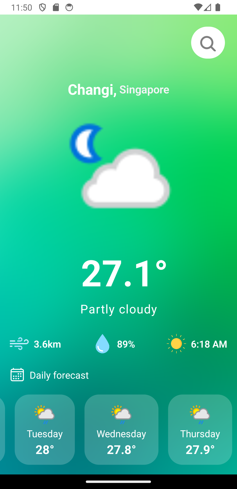
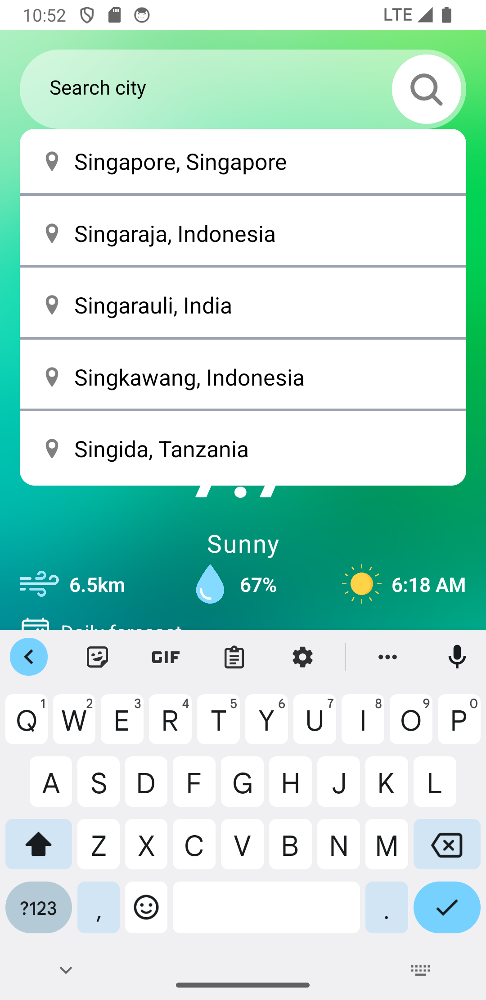

  <h1>Weather App 🌦️</h1>

  

    A simple weather application built with <strong>React Native</strong> that
    provides current weather information and a daily forecast using a weather
    API.
  

  

    
    
    
  

  

  <h2>Features</h2>
  <ul>
    <li>
      📍 <strong>Current Weather:</strong> Get real-time weather conditions
      based on location.
    </li>
    <li>
      🗓️ <strong>Daily Forecast:</strong> Provides a 7-day weather forecast.
    </li>
    <li>
      🔍 <strong>City Search:</strong> Search for a city to view its weather
      forecast.
    </li>
    <li>
      ☁️ <strong>Weather Conditions:</strong> Displays icons for weather
      conditions (e.g., cloudy, sunny, etc.).
    </li>
    <li>
      🎨 <strong>Beautiful UI:</strong> Clean and visually appealing design
      using React Native.
    </li>
    <li>
      📱 <strong>Responsive Layout:</strong> Optimized for mobile devices.
    </li>
  </ul>

  

  <h2>Screenshots</h2>
  

    
    
  

  

  <h2>Installation</h2>
  
1. Clone the repository:

  <pre><code>git clone https://github.com/sulochanbarakoti/weather_mobile_app.git
cd weather-app
</code></pre>

  
2. Install dependencies:

  <pre><code>npm install</code></pre>

  

    3. Get a free weather API key from
    <a href="https://www.weatherapi.com/">WeatherAPI</a> and replace the
    placeholder in your API request file.
  

  
4. Run the app:

  <pre><code>expo start</code></pre>

  

  <h2>Usage</h2>
  <ul>
    <li>Launch the app and search for a city using the search bar.</li>
    <li>
      View the current temperature, weather conditions, and other stats like
      wind speed and humidity.
    </li>
    <li>
      Swipe to see the daily forecast with temperature and weather condition
      icons.
    </li>
  </ul>

  

  <h2>Dependencies</h2>
  <ul>
    <li><strong>React Native:</strong> Mobile app framework</li>
    <li><strong>Expo:</strong> React Native development platform</li>
    <li><strong>react-native-vector-icons:</strong> Icon library</li>
    <li><strong>WeatherAPI:</strong> For weather data</li>
  </ul>

  

  <h2>API Setup</h2>
  

    1. Create an account at
    <a href="https://www.weatherapi.com/">WeatherAPI</a>.
  

  
2. Copy your API key.

  

    3. Replace the <code>YOUR_API_KEY</code> placeholder in your fetch request
    with the actual key.
  

  <pre><code>const API_KEY = 'YOUR_API_KEY';</code></pre>

  

  <h2>Contributing</h2>
  

    Contributions are welcome! Please submit a pull request or open an issue to
    contribute to this project.
  

  

  <h2>License</h2>
  

    This project is licensed under the MIT License. See the
    <a href="./LICENSE">LICENSE</a> file for more details.
  

